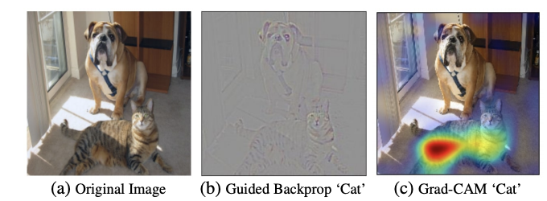

# ml-gasshuku2020

## MNIST

### 1. データセットの読み込み

#### データの格納方法について
ディープラーニングを学習させるためのデータセットを読み込みます．ディープラーニングでは主に4次元配列でデータを準備します．
フレームワークによって格納されている順番が違うのですが，pytorchでは[データ数、チャネル、画像の縦サイズ、画像の横サイズ]の順番でデータが格納されています．

教師ラベルのデータは、１次元もしくは二次元配列で用意します。 1次元の場合はクラスのインデックス(例えば３クラス分類にて犬なら0、イモリなら1、ヤモリなら2みたいな)を指定するが、二次元の場合はone-hot表現を用いる(犬なら[1,0,0]、イモリなら[0,1,0]、ヤモリなら[0,0,1]みたいな)。 これもフレームワークによって変わります。
pytorchではindex[データ数]のように管理をします．

#### データセットの用意
ディープラーニングで学習するデータセットを用意する方法としては，
1. 自分で用意する
2. オープンソースのデータを用意する
の2つあるのですが，今回はpytorchからダウンロードできるオープンデータセットを使って学習を行います．

#### 実装手順
1. ライブラリのimport
2. データセットの前処理方法の指定
3. trainデータの読み込み
4. trainデータをバッチサイズに固めて返すローダの作成
5. testデータの読み込み
6. testデータをバッチサイズに固めて返すローダの作成
7. 教師ラベルの作成

<details>
<summary>コードはこちら</summary>  
<p>  

```python
# 1. ライブラリのimport
import torch
import torchvision
import torchvision.transforms as transforms
import numpy as np
# 2. データセットの前処理方法の指定
transform = transforms.Compose(
    [transforms.ToTensor(),
     transforms.Normalize((0.5, ), (0.5, ))])
# 3. trainデータの読み込み
trainset = torchvision.datasets.FashionMNIST(root='./data', 
                                        train=True,
                                        download=True,
                                        transform=transform)
# 4. trainデータをバッチサイズに固めて返すローダの作成
trainloader = torch.utils.data.DataLoader(trainset,
                                            batch_size=100,
                                            shuffle=True,
                                            num_workers=2)
# 5. testデータの読み込み
testset = torchvision.datasets.FashionMNIST(root='./data', 
                                        train=False, 
                                        download=True, 
                                        transform=transform)
# 6. testデータをバッチサイズに固めて返すローダの作成
testloader = torch.utils.data.DataLoader(testset, 
                                            batch_size=100,
                                            shuffle=False, 
                                            num_workers=2)
# 7. 教師ラベルの作成
classes = tuple(np.linspace(0, 9, 10, dtype=np.uint8))
```

</p>
</details>


### 2. データセットの可視化

<details>
<summary>コードはこちら</summary>
<p>

```python
# データの可視化
import matplotlib.pyplot as plt
import numpy as np

# functions to show an image


def imshow(img):
    img = img / 2 + 0.5     # unnormalize
    npimg = img.numpy()
    plt.imshow(np.transpose(npimg, (1, 2, 0)))
    plt.show()


# get some random training images
dataiter = iter(trainloader)
images, labels = dataiter.next()

# show images
imshow(torchvision.utils.make_grid(images))
# print labels
print(' '.join('%5s' % classes[labels[j]] for j in range(4)))
```

</p>  
</details>

### 3. モデルの定義
| Layer | カーネルサイズ | フィルタ数 |  ストライド| パディング |  活性化関数 |
|:---:|:---:|:---:|:---:|:---:|:---:|
| Input | 28 x 28 x 1(入力サイズ) |||||
| Convolution | 3 x 3 | 32 | 1 | 0 | ReLU |
| Convolution | 3 x 3 | 64 | 1 | 0 | ReLU |
| MaxPooling | 2 x 2 | - | 1 | 0 | - |
| Dropout | - | - | - | - | - |
| MultiLayerPerceptron | 128 | - | - | - | ReLU |
| Dropout | - | - | - | - | - |
| MultiLayerPerceptron | 10 (クラス) | - | - | - | - |

```python
# モデル定義
class Net(nn.Module):
  def __init__(self):
        super(Net, self).__init__()
        self.conv1 = nn.Conv2d(1, 32, 3) # 28x28x32 -> 26x26x32
        self.conv2 = nn.Conv2d(32, 64, 3) # 26x26x64 -> 24x24x64 
        self.pool = nn.MaxPool2d(2, 2) # 24x24x64 -> 12x12x64
        self.dropout1 = nn.Dropout2d()
        self.fc1 = nn.Linear(12 * 12 * 64, 128)
        self.dropout2 = nn.Dropout2d()
        self.fc2 = nn.Linear(128, 10)

  def forward(self, x):
      x = F.relu(self.conv1(x))
      x = self.pool(F.relu(self.conv2(x)))
      x = self.dropout1(x)
      x = x.view(-1, 12 * 12 * 64)
      x = F.relu(self.fc1(x))
      x = self.dropout2(x)
      x = self.fc2(x)
      return x
```

### 4. 学習

#### step1. GPUの設定
#### step2. 学習パラメータの設定
#### step3. 学習

#### step4. モデルの保存

### 5. 予測

## モデルの可視化
基本的な流れは以上になりますが，CNNの学習モデルをチューニングする際に，CNNモデルの中身を理解することは重要です．
ここでは，CNNモデルの可視化手法について以下の3つの方法を紹介します．

1. GradCAM
2. 畳み込みフィルタの可視化

### 1. Grad-CAM
Grad-CAMとは，大雑把に言うとCNNの予測の根拠となった箇所をヒートマップで表示する技術です．



>原著: Grad-CAM: Visual Explanations from Deep Networks via Gradient-based Localization
>https://arxiv.org/abs/1610.02391


### 2. 畳み込みフィルタの可視化

